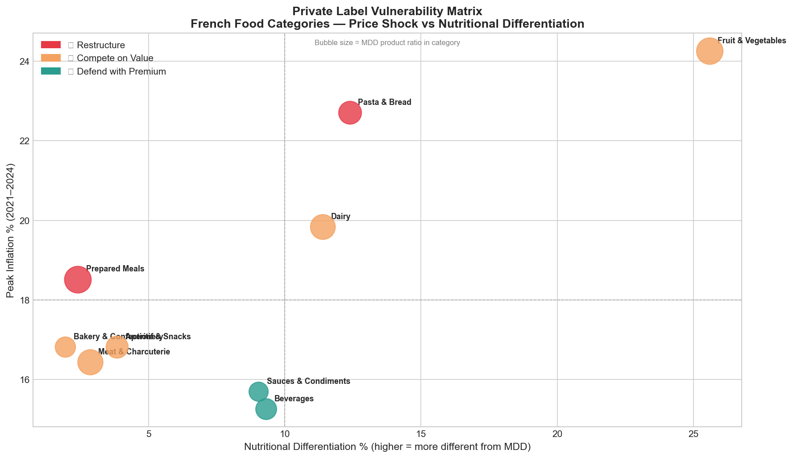

# 🏷️ The Private Label Shift: Mapping Permanent Brand Vulnerability in French Food Retail

> *An end-to-end data analysis project exploring which food categories French national brands have permanently lost to private label — and what product-level characteristics predict that vulnerability.*

---

## The Business Problem

Between 2021 and 2024, France experienced its worst food inflation in decades — peaking at **12.8% in 2023**. In response, French consumers systematically abandoned national brands (Bonduelle, Fleury Michon, Président, Barilla) in favour of retailer-owned private labels (MDD — *marques de distributeurs*) such as Carrefour, Leclerc, and Intermarché's own product lines.

This was expected. What was *not* expected: **consumers are not going back.**

Even as inflation cooled to under 2% by mid-2024, private label market share has held firm. In France today, **1 in 2 products purchased is a private label** (Kantar Worldpanel, 2024). National brand unit sales have fallen 7% since 2021, while private label unit sales have risen 2% (PLMA/Circana, 2024).

This creates an urgent, unresolved question for every French FMCG brand:

> **Which of our categories have we permanently lost — and which can we still defend?**

This project answers that question using publicly available data, economic reasoning, and reproducible Python analysis.

...
That is what this project builds.

## Key Output



---

## Research Questions

This project is structured around three nested questions, moving from descriptive to analytical to strategic:

**Q1 — Where did the shift happen?**
Which food categories experienced the deepest private label penetration during the 2021–2024 inflation period? How does this vary across category types (dairy, pasta, frozen, canned, aperitifs)?

**Q2 — What predicts vulnerability?**
Do measurable product-level characteristics — price premium size, nutritional differentiation, brand concentration within a category, product complexity — predict how deeply private label penetrated a category?

**Q3 — What can national brands actually do?**
Based on the analysis: which categories show signs of recoverability, which are structurally lost, and what strategic posture (price defence, premiumisation, reformulation) does the data support in each case?

---

## Why This Matters (and Who This Is For)

Every French food company with a national brand in grocery retail is facing this problem right now. This includes:

- **Dairy**: Président (Lactalis), Danone, Bel (La Vache qui Rit, Kiri)
- **Charcuterie/Ready meals**: Fleury Michon, Herta (Nestlé), Justin Bridou
- **Canned/Frozen vegetables**: Bonduelle, D'aucy, Cassegrain
- **Pasta/Dry goods**: Panzani, Barilla, Lustucru
- **Aperitifs/Snacks**: Belin, Lay's (PepsiCo), Benenuts

None of these companies have a clean, category-level answer to this question using public data. This project builds that answer from scratch — transparently, reproducibly, and with honest acknowledgment of data limitations.

---

## Data Sources

All data used in this project is **free, public, and reproducible**. No proprietary data is required.

### 1. Open Food Facts
- **URL**: https://world.openfoodfacts.org/data
- **What it contains**: 3 million+ food products globally, ~300,000 French products. Includes brand, category, nutritional information (Nutriscore), ingredient lists, packaging, price (where available), and retailer.
- **How we use it**: Product-level characteristics by category. Distinguish national brands from private labels. Measure nutritional differentiation and product complexity within categories.
- **Format**: CSV dump (~9GB full, filtered French subset ~800MB) or MongoDB export.

### 2. INSEE — Consumer Price Indices (IPC)
- **URL**: https://www.insee.fr/fr/statistiques/series/102699898
- **What it contains**: Monthly price indices by food category going back to 2015. Covers all major grocery categories at COICOP classification level.
- **How we use it**: Track price inflation trajectory by category from 2021–2024. Measure the size of the inflationary shock per category. Identify when/whether prices started recovering.
- **Format**: CSV download directly from INSEE portal.

### 3. INSEE — Household Consumption Data (Enquête Budget de Famille)
- **URL**: https://www.insee.fr/fr/statistiques/1893285
- **What it contains**: Household-level food expenditure patterns by product category and income bracket.
- **How we use it**: Understand which consumer income segments drove the switch most heavily — supplementary context for category vulnerability interpretation.
- **Format**: CSV/Excel download.

### 4. Kantar Worldpanel / PLMA Published Reports (Validation Layer)
- **What it contains**: Publicly released summary statistics on MDD market share by category and year, published annually.
- **How we use it**: Benchmark and validate our category-level vulnerability scores against observed market share figures. We do not reproduce their proprietary data — we use their public summaries as a reference check.
- **Sources**: PLMA International Private Label Yearbook (press release summaries), Kantar quarterly trend reports (public), LSA Commerce & Consommation published data.

---

## Project Structure

```
private-label-shift-france/
│
├── README.md                          ← You are here
├── requirements.txt                   ← Python dependencies
│
├── data/
│   ├── raw/                           ← Original downloaded files (not pushed to GitHub)
│   │   ├── openfoodfacts_france.csv
│   │   ├── insee_ipc_alimentation.csv
│   │   └── insee_budget_famille.csv
│   ├── processed/                     ← Cleaned, merged datasets
│   └── external/                      ← Kantar/PLMA public reference figures
│
├── notebooks/
│   ├── 01_business_brief.md           ← The problem in business language (start here)
│   ├── 02_data_exploration.ipynb      ← Understanding each dataset before any analysis
│   ├── 03_category_taxonomy.ipynb     ← Building the category classification system
│   ├── 04_price_analysis.ipynb        ← Inflation trajectories by category (INSEE)
│   ├── 05_product_characteristics.ipynb ← National brand vs MDD differences (OFF)
│   ├── 06_vulnerability_model.ipynb   ← The core analytical model
│   └── 07_strategic_implications.ipynb ← What the analysis means for brands
│
├── src/
│   ├── data_loader.py                 ← Functions to load and filter raw data
│   ├── category_classifier.py         ← Map OFF categories to analysis taxonomy
│   ├── price_metrics.py               ← Compute inflation indices and price gaps
│   ├── vulnerability_scorer.py        ← Core scoring logic
│   └── visualisations.py              ← Reusable chart functions
│
└── outputs/
    ├── figures/                       ← All charts and visualisations
    └── vulnerability_scores.csv       ← Final category-level output table
```

---

## Methodology Overview

### Step 1 — Build the Category Taxonomy
Open Food Facts uses its own messy category system. The first analytical task is mapping it cleanly onto 10–12 food categories that match INSEE's price classification. This is not just data cleaning — it requires judgment about what belongs together economically (e.g., fresh pasta vs. dry pasta behave very differently under an inflationary shock).

### Step 2 — Measure the Inflationary Shock by Category
Using INSEE monthly IPC data, compute for each category:
- Peak inflation (highest YoY % change, 2021–2024)
- Duration of shock (how many months above 5% inflation)
- Price recovery rate (how much prices have come down since peak, if at all)

This gives us the independent variable: the size of the economic pressure that drove switching.

### Step 3 — Characterise Each Category from Open Food Facts
For each category, compute:
- **Price premium ratio**: average price of national brand products vs. private label products (where price data is available in OFF)
- **Nutritional differentiation score**: how different are national brand and private label products nutritionally within the same category (Nutriscore distribution, macronutrient variance)
- **Brand concentration**: how many national brands compete in this category? Is it one dominant player or fragmented?
- **Product complexity**: average number of ingredients, presence of quality certifications (AOP, IGP, Label Rouge), packaging complexity

### Step 4 — Build the Vulnerability Model
A regression model (logistic or OLS depending on how we frame the outcome variable) where:
- **Outcome**: Category vulnerability score — derived from how deep MDD penetration went and whether any recovery has occurred (benchmarked against Kantar public data)
- **Predictors**: Price premium size, nutritional differentiation, brand concentration, inflationary shock magnitude

The point of the model is not prediction accuracy — it is coefficient interpretation. Which characteristics are most strongly associated with permanent switching? That is an economic question, not a machine learning one.

### Step 5 — Translate to Strategic Recommendations
For each category, assign one of three strategic postures based on the analysis:

| Posture | Condition | Implication |
|---|---|---|
| **Defend with premium** | High nutritional differentiation, moderate price gap, partial recovery | Invest in quality signalling, reformulation, origin labelling |
| **Compete on value** | Low differentiation, high price gap, no recovery | Price gap reduction, promotional investment |
| **Restructure** | Commoditised, deep MDD penetration, zero recovery signal | Rationalise SKUs, explore private label manufacturing partnerships |

---

## Honest Limitations

This project is built on public data. There are things we cannot measure and we say so clearly:

- **No individual transaction data**: We do not have household-level switching data. Category-level inference is our ceiling.
- **Price data in OFF is incomplete**: Not all products have price fields. We work with the subset that does and note the coverage.
- **MDD market share is estimated**: We do not have access to Nielsen or Kantar's proprietary panel data. Our vulnerability scores are constructed proxies, benchmarked against their public summaries — not direct measurements.
- **Causality is asserted, not proven**: We can show correlation between product characteristics and vulnerability. A true causal claim would require a natural experiment design with richer data. We frame conclusions accordingly.

Stating limitations clearly is not weakness. It is what separates rigorous analysis from a Kaggle notebook.

---

## How to Run This Project

```bash
# Clone the repository
git clone https://github.com/namankaurDS/private-label-shift-france.git
cd private-label-shift-france

# Install dependencies
pip install -r requirements.txt

# Download data (see data/README.md for exact download instructions)
# Then start with the business brief before any notebook
open notebooks/01_business_brief.md
```

---

## Tech Stack

| Tool | Purpose |
|---|---|
| Python 3.11 | Core language |
| pandas | Data manipulation |
| matplotlib / seaborn | Visualisation |
| scikit-learn | Regression modelling |
| Jupyter Notebooks | Analysis and presentation |
| VS Code | Development environment |

---

## Author

**Naman Kaur** — MRes Economics, Paris School of Economics  
Trained in causal inference, panel data analysis, and applied econometrics.  
Applying economic reasoning to real FMCG business problems.

[GitHub](https://github.com/namankaurDS) | [Portfolio](https://namankaurDS.github.io)

---

## Status

🔄 **In Progress** — March 2026

- [x] Business problem defined and sourced
- [x] Data sources identified and validated
- [ ] Data download and initial exploration
- [ ] Category taxonomy built
- [ ] Price analysis complete
- [ ] Product characteristics analysis complete
- [ ] Vulnerability model built
- [ ] Strategic implications written
